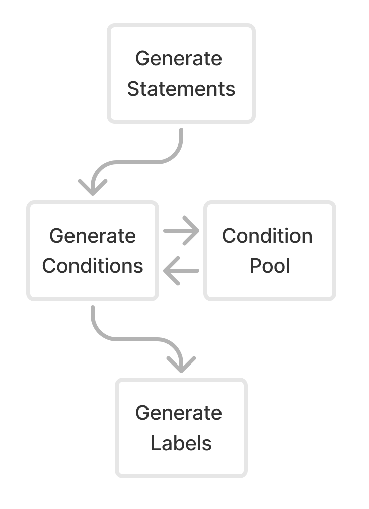

# Data Generation Details

## Generation Pipeline

This section provides comprehensive technical details for our data generation pipeline, expanding upon the overview presented in Section 3.1.2. The pipeline consists of three main components: statement generation, condition generation, and labeling, with the flow between components illustrated in the figure above. Each component required careful parameter tuning and prompt engineering to produce high-quality, balanced datasets suitable for model training.

Our synthetic data generation approach prioritized both diversity and consistency, implementing controls at each stage to ensure data quality while maintaining broad coverage of potential use cases. The following subsections detail the specific implementation choices, prompting strategies, and parameter settings used throughout the pipeline. This information is particularly relevant for researchers seeking to reproduce or build upon our synthetic data generation methodology.

### Statement Generation Approach

This section expands upon the data generation methodology outlined in Section 3.1.2, which produces the labeled statement-condition pairs required for training the AEN architecture. Our pipeline employs a sequential generation approach, first creating conversational statements, then deriving conditions, achieving a balanced 1:6 class distribution ratio. The following subsections detail the technical implementation, including prompt engineering strategies and parameter configurations used throughout each stage of the generation process.

#### Statement Generation Implementation

We encouraged data variety through creating a prompt template taking in two inputs:

> "Generate a conversation 25 statements long set in the context of {context}. During the conversation someone should {action_data} and perform any other relevant software actions."

**Context Generation:** The {context} input comes from a list of thousands of different settings in which the conversation may occur. We create this list by transforming Wikipedia Articles into potential settings through OpenAI GPT calls. We take inspiration from (Bauer, 2024) prompting:

> "What group activity {random.choice(verb_list)} the noun? Respond with one in 5 or less tokens. Respond explicitly (don't use the word it)."

**Action Data Generation:** The {action_data} list of potential actions is derived from a similar process. We use the top 1000 websites by traffic, identifying actions that can be performed on each site. While we include actions because the primary use case monitors action-related interest, we also create non-action conditions for generalizability.

This approach yields tens of millions of possible prompts for statement generation. We maintain multiple instruction prompt variations and curated examples to ground the model for realistic results. We generate full conversations (25+ statements per call) to benefit from developing narratives, as individual statements limited response diversity.

For the Language Model settings at the statement generation stage, we use a temperature of 1.6 and a Top P of 0.85, encouraging creativity while maintaining coherence.

### Condition Generation

Following the generation of statements, we proceed to create conditions that these statements might satisfy.

Our condition generation process follows these steps:

1. **Transcript-Specific Condition Generation:**
   We use each transcript (25+ statements) to inform the generation of conditions (3+). By making separate condition API calls for each transcript, we ensure every transcript contains statements satisfying the generated conditions.

2. **Database Storage:**
   We save generated conditions to maintain a diverse pool for continued use and analysis.

3. **Cross-Pollination:**
   We cross-pollinate transcript-specific conditions with other transcript groups, pairing conditions generated for one transcript with statements from others. This increases pair diversity while reducing biases from original pairings. It also introduces comparisons between unrelated topics, allowing sparse parts of the vector space to interact.

For condition generation, we set the Language Model parameters to a temperature of 1 and Top P of 1. These settings allow creativity while maintaining coherence, with the lower temperature (compared to 1.6 for statements) ensuring more focused conditions.

### Labeling Generation

The final step in our pipeline involves labeling statement-condition pairs, with each transcript containing at least 75 pairs (25 statements × 3 conditions). This process presented unique challenges, as GPT-4o and its mini version struggled to efficiently label entire transcript datasets, while individual pair labeling proved cost-inefficient.

To address this, we developed an optimized approach: pairing each statement with the full set of conditions and making a single API call to label it against all conditions simultaneously. This method balances efficiency and cost-effectiveness while maintaining comprehensive labeling.

For the labeling process, we set the Language Model parameters to Temperature 0 and Top P of 1, prioritizing deterministic outputs for consistent and reliable binary classification.

## Prompting Techniques

Below details a subset of multi shot examples we used at each stage of synthetic generation. Examples are randomly selected per datapoint.

### Statements

Here we detail two of the 16 different examples we used in the Multishot generation.

#### Example 1: Party Planning Discussion

**Charlotte:** Hey Sarah, I was thinking about throwing a big 4th of July party this year. Would you want to help me plan it?

**Sarah:** Yeah, that sounds awesome! I love 4th of July parties. Where were you thinking of having it?

**Charlotte:** I was thinking we could do it at my place, since I have that big backyard with plenty of space for people to hang out.

**Sarah:** Ooh perfect, your yard would be great for that. We could set up some lawn games and maybe even a little dance floor area.

**Charlotte:** I like the way you think! And of course we'll need to grill up a ton of food. Burgers, hot dogs, maybe some BBQ chicken?

**Sarah:** Definitely, it wouldn't be a 4th of July party without a big cookout. And we can ask people to bring side dishes potluck style.

**Charlotte:** Good call. Hey, what do you think about setting up a Facebook event to invite people and coordinate everything?

**Sarah:** Hmm, I'm not really a fan of using Facebook for stuff like this. I feel like it's hard to keep things organized there.

**Charlotte:** Really? I've found Facebook events pretty helpful for parties in the past. But I'm open to other ideas if you have a better suggestion!

**Sarah:** What about a shared Google Doc instead? We can make different sections for the guest list, food sign-ups, supplies we need, a schedule for the day, etc.

**Charlotte:** Okay, I can see that working well. We can share the Doc link on the actual invite.

**Sarah:** Yeah, an email invite with the Doc link is perfect. We can make it really festive and Fourth of July themed.

**Charlotte:** Sounds great. And I'll start brainstorming ideas for decorations and activities. Maybe we could even put together little welcome bags for everyone with mini flags and sparklers and stuff.

**Sarah:** Ooh I love that! Very festive. I'll add a section for welcome bag ideas to the Doc too. This is going to be such a fun party!

#### Example 2: Vacation Planning

**Olivia:** I've been thinking about our next vacation. How about a trip to the mountains?

**Ethan:** I don't know. The mountains can be so cold and remote. Why not a beach destination instead?

**Olivia:** I get that, but the mountains offer a peaceful retreat. We could do some hiking, enjoy the fresh air, and get away from the crowds.

**Ethan:** But what if we want some activities and nightlife? The beach has so much more to do.

**Olivia:** True, but the mountains have their own charm. Think about the cozy cabins, the beautiful sunsets, and maybe even a bit of snow. Plus, we can still find local events and things to do in the nearby town.

**Ethan:** Hmm, I hadn't thought about it that way. A cabin sounds nice. We could use this trip to really unplug and relax.

**Olivia:** Exactly! And we can always check out nearby attractions if we get bored. I'll look up some cabin rentals and send you the links.

**Ethan:** Alright, you've convinced me. Let's go for it! I'll start packing some warm clothes.

**Olivia:** Great! I'll handle the bookings and share the details with you later.

**Ethan:** I hope we can find a cabin with a fireplace. That would be perfect for chilly evenings.

**Olivia:** I'll make sure to find one. We can also plan some fun activities like skiing or snowboarding if there's enough snow.

**Ethan:** That sounds exciting! Maybe we can also find a local spa for a relaxing day.

**Olivia:** Definitely! A spa day would be a nice treat. I'll look for cabins near a good spa.

**Ethan:** This trip is shaping up to be a perfect blend of adventure and relaxation. Can't wait!

**Olivia:** Me neither. Let's finalize everything by the end of the week so we can start counting down the days.

### Conditions

These examples expand upon the conversations presented in the previous statements section. Each example demonstrates multiple instances where specific thresholds are met within natural dialogue.

#### Example 1 Cont.

- When someone asks for planning help
- When someone mentions using Facebook events or Google Docs
- When someone suggests an actionable planning item

#### Example 2 Cont.

- When someone discusses vacation planning
- When someone talks about booking accommodations
- When someone mentions looking up local attractions

Each conversation is designed to contain 2-4 distinct thresholds that may be triggered multiple times throughout the dialogue.

### Labels

Last we present examples showing how the model evaluates individual statements against a set of conditions.

#### Example 1: Using Digital Assistants

**Input Statement:**

> "Jamie: I use Siri all the time to set reminders and check the weather. It's so convenient."

**Conditions Tested:**

1. When someone orders food using a food delivery app
2. When someone expresses excitement about improving workflow and productivity
3. When someone discusses the impact of AI on daily activities
4. When someone talks about using AI-powered assistants
5. When someone suggests joining a fitness challenge using a fitness tracking app

**Classification Results:** [0, 0, 1, 1, 0]

#### Example 2: Scientific Observation

**Input Statement:**

> "David: Speaking of observation, have you ever used a time-lapse camera to record the feeding behavior of the octopuses?"

**Conditions Tested:**

1. When someone offers assistance with art supplies
2. When someone reflects on emotions tied to a place or experience
3. When someone plans a scientific observation project
4. When someone proposes recording footage for research purposes
5. When someone talks about analyzing animal behavior

**Classification Results:** [0, 0, 0, 1, 1]
